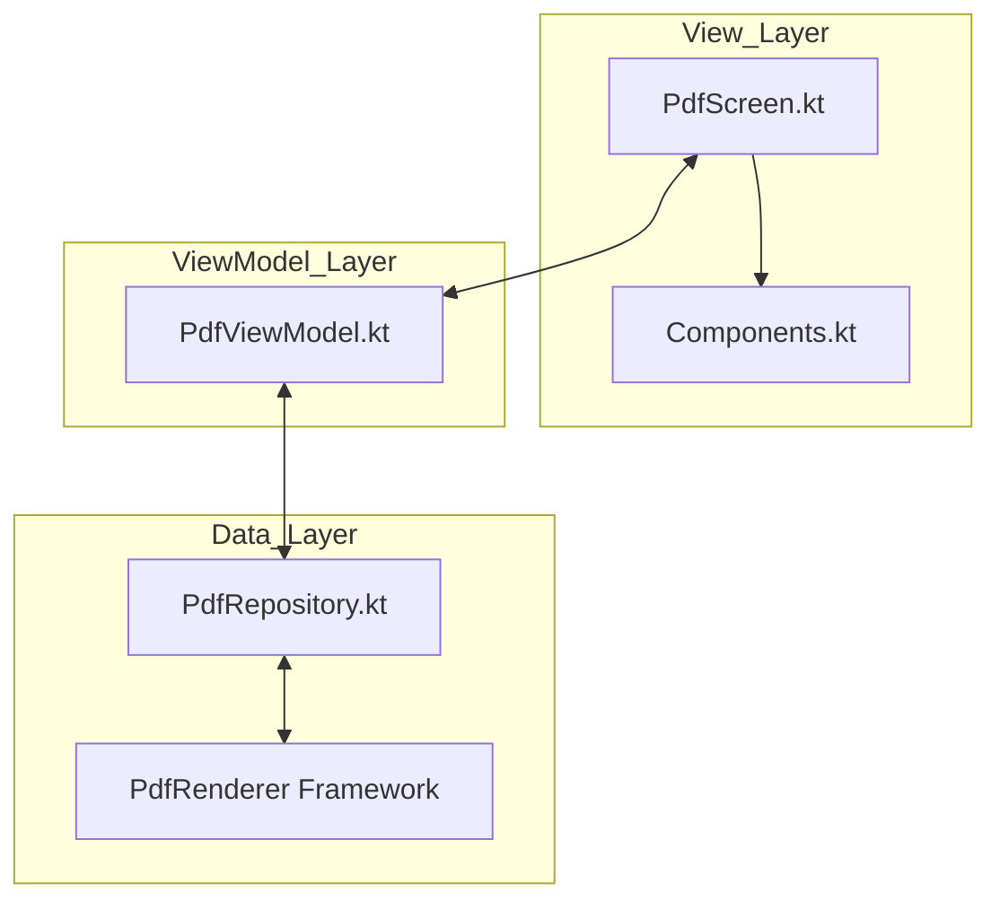
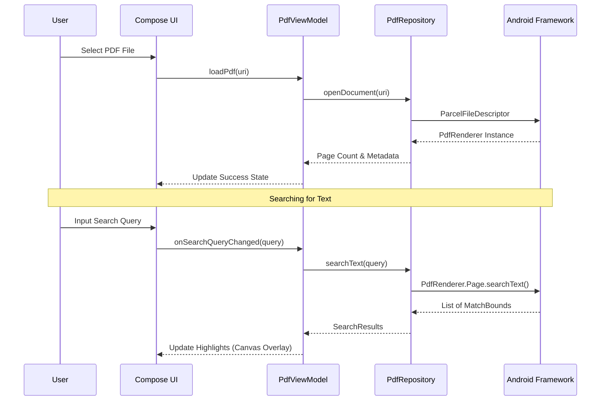

# 🚀 PDF Render: A Modern Android Journey 🎨

  
  
  
  
  

---

## 🌟 Project Brief
**PDF Render** is a high-performance, visually stunning Android application developed as a personal education project. The primary goal of this project is to master **Modern Android Development (MAD)** practices, explore the latest **Android 15 APIs**, and push the boundaries of **Jetpack Compose** animations and UI/UX design.

This isn't just a PDF reader; it's an exploration of how high-performance document rendering can coexist with a vibrant, neon-modern aesthetic (Neon-Glassmorphism).

---

## 🏆 MAD Score (Modern Android Development)
| Category | Score | Details |
| :--- | :--- | :--- |
| **Language** | 🚀 100% | Pure Kotlin with Coroutines and Flows. |
| **UI** | ✨ 100% | 100% Jetpack Compose with complex animations. |
| **Architecture** | 🏛️ 90% | Strict MVVM with Repository pattern. |
| **Jetpack** | 📦 95% | Lifecycle, ViewModel, Compose-BOM, Material 3. |
| **Android 15** | 📱 100% | Integrated latest `PdfRenderer.Page.searchText` API. |

---

## 📸 Visual Showcase

  
  
  

---

## 🛠️ Technical Architecture

### 🏛️ MVVM Pattern
The application follows a clean separation of concerns to ensure scalability and testability.

### 🔄 Data Flow (PDF Rendering & Search)

---

## ✨ Features & Learning Objectives

### 1. High-Performance Rendering
- **Learning Objective**: Memory-efficient bitmap handling.
- **Implementation**: Utilizes a `LazyColumn` for virtualization and scales bitmaps (2x) for Retina-level clarity without crashing the heap.

### 2. Android 15 Search API 🔍
- **Learning Objective**: Working with cutting-edge system APIs.
- **Implementation**: Integrates `android.graphics.pdf.PdfRenderer.Page.searchText` to find and extract text coordinates in real-time.

### 3. Neon-Glassmorphism UI 🎨
- **Learning Objective**: Advanced Compose Graphics & Animations.
- **Implementation**: 
    - **Animated Gradients**: Custom background shaders that flow between Deep Space and Indigo.
    - **Glassmorphism**: Top bars with real-time blur and translucency.
    - **Pulse Animations**: Infinite transitions using `animateColor` and `animateFloat`.

---

## 📦 Dependencies
- `androidx.compose.ui`: Modern UI Toolkit
- `androidx.lifecycle.viewmodel-compose`: Architecture support
- `androidx.graphics.pdf`: Framework PDF handling
- `kotlinx.coroutines`: Asynchronous processing
- `androidx.compose.material.icons.extended`: Vibrant icon sets

---

## 👨‍💻 About the Developer
This project is part of my professional development portfolio. I am dedicated to mastering the Android ecosystem and staying ahead of the curve with the latest Google technologies.

---

  <b>Built with Kotlin</b>

---
